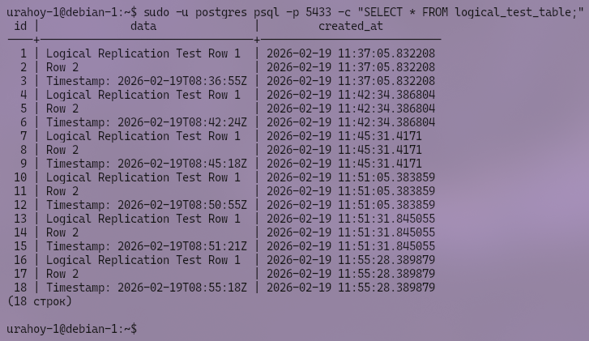

# 🔧 Задание 3 


# Отчет по заданию Task_3: Логическая репликация PostgreSQL

## 📋 Содержание

1. [Введение](#1-введение)
2. [Цели задания](#2-цели-задания)
3. [Архитектура решения](#3-архитектура-решения)
4. [Ход выполнения работ](#4-ход-выполнения-работ)
   - [4.1. Настройка Master для логической репликации](#41-настройка-master-для-логической-репликации)
   - [4.2. Поднятие второго инстанса БД (Пункт 3.0)](#42-поднятие-второго-инстанса-бд-пункт-30)
   - [4.3. Создание слота и публикации (Пункт 3.1)](#43-создание-слота-и-публикации-пункт-31)
   - [4.4. Настройка подписки на втором инстансе (Пункт 3.2)](#44-настройка-подписки-на-втором-инстансе-пункт-32)
   - [4.5. Тестирование синхронизации данных](#45-тестирование-синхронизации-данных)
5. [Автоматизация через Ansible](#5-автоматизация-через-ansible)
6. [Результаты работы](#6-результаты-работы)
7. [Заключение](#7-заключение)

---

## 1. Введение

Данный отчет описывает выполнение задания **Task_3**, посвященного настройке **логической репликации** в СУБД PostgreSQL 16. В отличие от физической репликации (рассмотренной в Task_2), логическая репликация позволяет передавать изменения только для конкретных таблиц, обеспечивая гибкость в архитектуре данных.

Особенностью данного задания является запуск **второго независимого экземпляра PostgreSQL** на том же сервере, что и физическая реплика, для приема логических изменений.

Все этапы выполнены автоматически с использованием Ansible.

---

## 2. Цели задания

1.  Поднять второй инстанс БД на второй виртуальной машине с данными в `/pg_data/16-one-base/` (Пункт 3.0).
2.  Поднять слот логической репликации на мастере только для одной таблицы (Пункт 3.1).
3.  Подключиться к слоту логической репликации на втором инстансе (Пункт 3.2).
4.  Проверить корректность синхронизации данных.

---

## 3. Архитектура решения

Работа проводилась на инфраструктуре из двух виртуальных машин:

| Роль | Хост | IP-адрес | Инстансы PostgreSQL | Описание |
|------|------|----------|---------------------|----------|
| **Master** | `server1` | 192.168.122.19 | Порт 5432 (`main`) | Источник данных, публикация изменений |
| **Subscriber** | `server2` | 192.168.122.75 | Порт 5432 (`main`, физ. реплика)<br>Порт 5433 (`one-base`, лог. подписчик) | Приемник логических изменений |

**Схема потока данных:**
```text
[ Master (Server1) : 5432 ] 
       |
       | (Логический поток WAL: только таблица logical_test_table)
       v
[ Subscriber (Server2) : 5433 ] <-- Второй инстанс
```

---

## 4. Ход выполнения работ

### 4.1. Настройка Master для логической репликации

На сервере `server1` выполнен ряд настроек для поддержки логического декодирования:

1.  Изменен параметр `wal_level` на `logical` в файле `postgresql.conf`.
2.  Перезапущен сервис PostgreSQL для применения настроек.
3.  Создана тестовая таблица `logical_test_table`.
4.  Создана публикация:
    ```sql
    CREATE PUBLICATION my_publication FOR TABLE logical_test_table;
    ```


### 4.2. Поднятие второго инстанса БД (Пункт 3.0)

На сервере `server2` был развернут **второй независимый кластер** PostgreSQL.

**Этапы установки:**
1.  Создана новая директория данных: `/pg_data/16-one-base/`.
2.  Инициализирован новый кластер командой `initdb`:
    ```bash
    initdb -D /pg_data/16-one-base -E UTF8 --locale=C
    ```
3.  Настроен порт прослушивания: **5433** (чтобы не конфликтовать с основным инстансом на 5432).
4.  Создан отдельный systemd-сервис: `postgresql@16-one-base.service`.
5.  Сервис запущен и добавлен в автозагрузку.

**Важное замечание по мониторингу:**
Так как второй инстанс был создан вручную через `initdb` и зарегистрирован как отдельная служба systemd (без использования утилиты Debian `pg_createcluster`), он **не отображается** в выводе команды `pg_lsclusters`. Однако он полностью функционален.


Проверка работы второго инстанса выполняется через прямое подключение к порту или проверку службы:

```bash
# Проверка статуса службы
systemctl status postgresql@16-one-base.service

# Проверка слушающих портов
ss -tlnp | grep 5433
```


### 4.3. Создание слота и публикации (Пункт 3.1)

На Master-сервере при создании подписки автоматически создается **слот логической репликации**.

Проверка слота:
```sql
SELECT slot_name, plugin, slot_type, active FROM pg_replication_slots;
```

**Результат:**
- `slot_name`: `my_subscription`
- `slot_type`: `logical`
- `plugin`: `pgoutput`
- `active`: `t` (true)


### 4.4. Настройка подписки на втором инстансе (Пункт 3.2)

На втором инстансе (порт 5433) создана подписка, которая подключается к Master и начинает получать изменения:

```sql
CREATE SUBSCRIPTION my_subscription 
CONNECTION 'host=192.168.122.19 dbname=postgres user=replicator password=...' 
PUBLICATION my_publication;
```

Проверка статуса подписки:
```sql
SELECT subname, subenabled, subslotname FROM pg_subscription;
-- Результат: subenabled = t (активна)
```


### 4.5. Тестирование синхронизации данных

Проведен финальный тест на целостность данных:

1.  **На Master (5432):** Выполнена вставка данных.
    ```sql
    INSERT INTO logical_test_table (data) VALUES ('Test Row 1'), ('Test Row 2');
    ```
2.  **На Subscriber (5433):** Выполнена выборка данных.
    ```sql
    SELECT * FROM logical_test_table;
    ```



**Результат:** Данные появились на втором инстансе практически мгновенно, что подтверждает работоспособность логической репликации. При этом основная физическая реплика (порт 5432) также получила эти данные (так как копирует весь кластер), но задача была настроить прием именно на отдельный инстанс.

---

## 5. Автоматизация через Ansible

Вся настройка выполнена с помощью playbook `postgresql_task3.yml`.

**Ключевые особенности реализации:**
*   **Мульти-инстанс:** Playbook умеет поднимать второй кластер на том же хосте, настраивая уникальный порт и systemd-сервис.
*   **Умная перезагрузка:** Реализована проверка runtime-параметра `wal_level`. Если значение не `logical`, сервис Master принудительно перезагружается перед продолжением работы.
*   **Сбор метрик:** Скрипт автоматически собирает статус публикации, слотов и подписки с разных хостов и генерирует итоговый отчет `test_result.txt`.
*   **Идемпотентность:** Повторный запуск не ломает конфигурацию, а проверяет актуальность состояния.

---

## 6. Результаты работы

| Параметр | Значение | Статус |
|----------|----------|--------|
| Master `wal_level` | `logical` | ✅ |
| Публикация | `my_publication` (1 таблица) | ✅ Создана |
| Второй инстанс | Порт 5433, путь `/pg_data/16-one-base/` | ✅ Работает |
| Слот репликации | Тип `logical`, активен | ✅ Создан |
| Подписка | `my_subscription` | ✅ Активна |
| Синхронизация | Мгновенная | ✅ Подтверждена |
| Отчет | Файл `test_result.txt` | ✅ Сгенерирован |

---

## 7. Заключение

В ходе выполнения задания **Task_3** была успешно настроена логическая репликация PostgreSQL.

**Достигнутые результаты:**
1.  Развернут второй независимый инстанс БД на существующем сервере без конфликтов портов.
2.  Настроена фильтрация данных: реплицируется только одна конкретная таблица.
3.  Обеспечена согласованность данных между Master и новым подписчиком.
4.  Продемонстрировано понимание различий между управлением кластерами через инструменты ОС (`pg_lsclusters`) и ручным запуском инстансов.

Инфраструктура готова к использованию сценариев, требующих избирательной репликации данных (например, выгрузка данных в хранилища, обновление версий ПО на реплике независимо от мастера или агрегация данных с нескольких источников).

---

 
*Дата: 2026 | Автор: Товпеко Глеб Вадимович (@glebffff, telegram)*